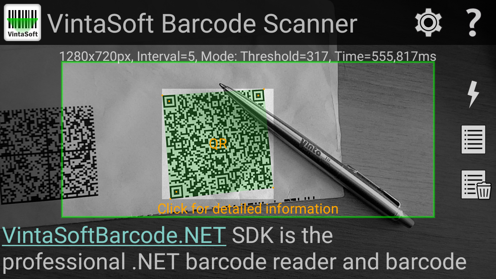
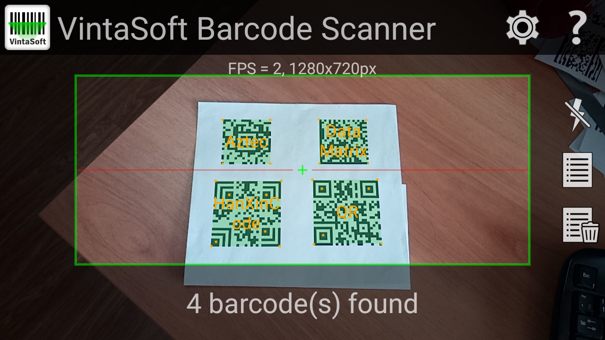
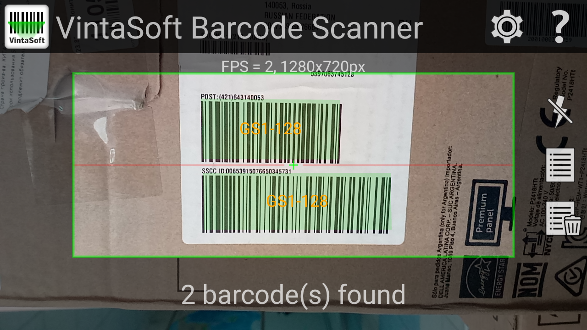

<h1>VintaSoft Xamarin Android Barcode Scanner Demo</h1>

Demo application shows how to recognize barcodes in Android application. Demo uses functionality of <a href="https://www.vintasoft.com/vsbarcode-dotnet-index.html">VintaSoft Barcode .NET SDK</a>. Source codes for C# are available.

<h2>Screenshots</h2>

<h2>Download</h2>
VintaSoft Barcode .NET SDK distributive package can be downloaded here: https://www.vintasoft.com/download.html

<h2>Documentation</h2>
VintaSoft Barcode .NET SDK on-line User Guide and API Reference for Xamarin development is available here: https://www.vintasoft.com/docs/vsbarcode-dotnet-xamarin/

<h2>Support</h2>
Please visit our <a href="https://www.vintasoft.com/support/">online support center</a> if you have any question or problem.

<h2>Google Play</h2>
VintaSoft Barcode Scanner application, which is based on this demo, can be downloaded from Google Play: https://play.google.com/store/apps/details?id=com.vintasoft.barcodescanner
